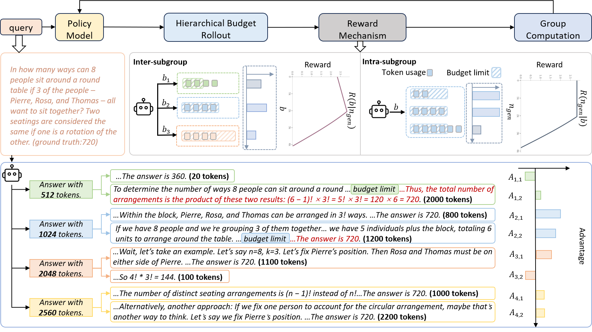

<div align="center">
# Hierarchical Budget Policy Optimization

**A Reinforcement Learning Framework for Adaptive Reasoning Efficiency**

[](http://arxiv.org/abs/2507.15844)
[](https://www.alphaxiv.org/abs/2507.15844)
[](https://github.com/zju-real/HBPO)
</div>

## Abstract

Modern reasoning models suffer from computational inefficiency, generating unnecessarily verbose explanations regardless of problem complexity. While these models can solve complex mathematical proofs requiring thousands of tokens, they often apply the same extensive reasoning to simple arithmetic problems.

**Hierarchical Budget Policy Optimization (HBPO)** solves this fundamental challenge by teaching models to adapt their reasoning depth to problem complexity. Through structured exploration across multiple token budgets, HBPO enables models to automatically allocate computational resources—using concise reasoning for simple problems and extended chains for complex tasks.

**Key Achievement**: 60.6% token reduction with 3.14% accuracy improvement across mathematical reasoning benchmarks.

## Problem Statement

Current efficient reasoning approaches face two critical limitations:

1. **Exploration Space Collapse**: Length penalties systematically bias models away from necessary long reasoning paths during training
2. **Uniform Resource Allocation**: Static constraints fail to capture the heterogeneous nature of reasoning requirements across different problem types

## Method Overview



HBPO introduces a hierarchical training framework with three core components:

### 1. Hierarchical Budget Exploration
- Partitions rollout samples into subgroups with distinct token budgets (512, 1024, 2048, 2560)
- Maintains exploration diversity throughout training
- Prevents systematic degradation of reasoning capabilities

### 2. Differentiated Reward Mechanisms  
- Budget-specific piecewise reward functions
- Monotonically non-decreasing rewards within allocated budgets
- Deviation penalties for responses exceeding budget constraints

### 3. Emergent Adaptive Behavior
- Models learn to recognize problem complexity indicators
- Automatic computational effort adjustment without external control
- Natural correspondence between task requirements and resource allocation

## Experimental Results

### Main Performance Metrics

**Reasoning Performance**:

| Method | GSM8K | MATH500 | Olympiad | AIME25 | Average |
|--------|-------|---------|----------|---------|---------|
| **Accuracy (%)** |
| Baseline | 86.1 | 87.0 | 51.6 | 30.0 | 63.7 |
| HBPO | **87.6** | **86.2** | **50.0** | **31.1** | **63.7** |
| **Token Usage** |
| Baseline | 1,684 | 2,938 | 5,330 | 9,023 | 4,744 |
| HBPO | **790** | **1,818** | **2,861** | **3,988** | **2,364** |

### Comparative Analysis

| Method | Strategy | Avg Accuracy | Avg Tokens | Trade-off |
|--------|----------|--------------|------------|-----------|
| AutoThink | Binary selection | 63.2 | 4,744 | -0.7% accuracy |
| L1-Max | Explicit control | 60.4% | 2,547 | -3.3% accuracy |
| **HBPO** | **Hierarchical exploration** | **63.7%** | **2,364** | **same accuracy, -50.2% tokens** |

### Adaptive Reasoning Behavior

HBPO demonstrates genuine adaptability in token allocation:

- **GSM8K (Basic Math)**: 790 tokens on average
- **MATH500 (Intermediate)**: 1,818 tokens on average  
- **Olympiad (Advanced)**: 2,861 tokens on average
- **AIME25 (Competition)**: 3,988 tokens on average

Unlike existing methods that maintain uniform token usage, HBPO naturally scales computational effort with problem complexity.

## Installation & Usage

### Requirements

```bash
conda create -n hbpo python=3.10
conda activate hbpo
pip install -e .
```

### Training

Execute HBPO training with hierarchical budget exploration:

```bash
bash examples/grpo_trainer/run_qwen2-7b_deepscale.sh
```

### Evaluation

Setup evaluation environment:

```bash
conda create -n eval_env python=3.10
conda activate eval_env

git clone https://github.com/NovaSky-AI/SkyThought.git
cd SkyThought && pip install -e .
```

Run benchmark evaluation:

```bash
skythought evaluate \
  --model <model_path> \
  --task math500 \
  --backend vllm \
  --sampling-params temperature=0.6,top_p=0.95,max_tokens=32768 \
  --n 1 \
  --batch-size 128 \
  --result-dir results/
```

## Technical Implementation

### Hierarchical Sampling Strategy

For each training query, HBPO generates responses across multiple budget constraints:

```python
budgets = [512, 1024, 2048, 2560]  # Token limits per subgroup
prompts = [f"I will answer within {b} tokens" for b in budgets]
```

### Reward Function Design

Piecewise reward structure balancing exploration and efficiency:

```python
def hierarchical_reward(correctness, length, budget):
    if correctness and length <= budget:
        return min(exploration_reward(length), budget_reward(budget))
    else:
        return 0
```

### Policy Optimization

Advantage computation incorporates both intra-subgroup and inter-subgroup comparisons:

- **Intra-subgroup**: Compare responses within same budget constraint
- **Inter-subgroup**: Enable cross-budget learning through global baselines

## Repository Structure

```
HBPO/
├── verl/                  # Core framework
│   ├── trainer/           # Training algorithms
│   ├── workers/           # Distributed components  
│   └── utils/             # Utilities
├── examples/              # Training scripts
│   ├── grpo_trainer/      # HBPO implementation
│   └── data_preprocess/   # Data preparation  
├── rllm/                  # reward function design   
├── tests/                 # Test suites
├── docs/                  # Documentation
└── figures/               # Paper figures
```


## Citation

```bibtex
@misc{lyu2025hierarchicalbudgetpolicyoptimization,
      title={Hierarchical Budget Policy Optimization for Adaptive Reasoning}, 
      author={Shangke Lyu and Linjuan Wu and Yuchen Yan and Xingyu Wu and Hao Li and Yongliang Shen and Peisheng Jiang and Weiming Lu and Jun Xiao and Yueting Zhuang},
      year={2025},
      eprint={2507.15844},
      archivePrefix={arXiv},
      primaryClass={cs.AI},
      url={https://arxiv.org/abs/2507.15844}, 
}
```

## Contact

For questions about the research or implementation, please open an issue or contact the author: `lyusk@zju.edu.cn`.
