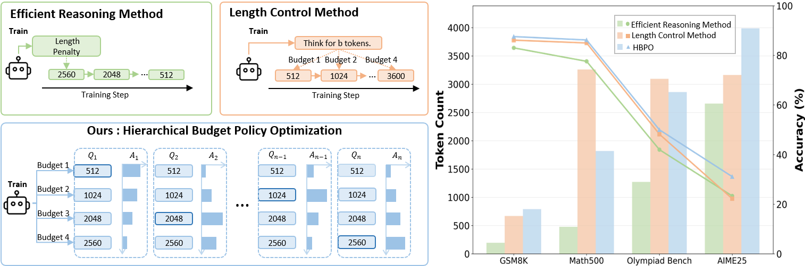
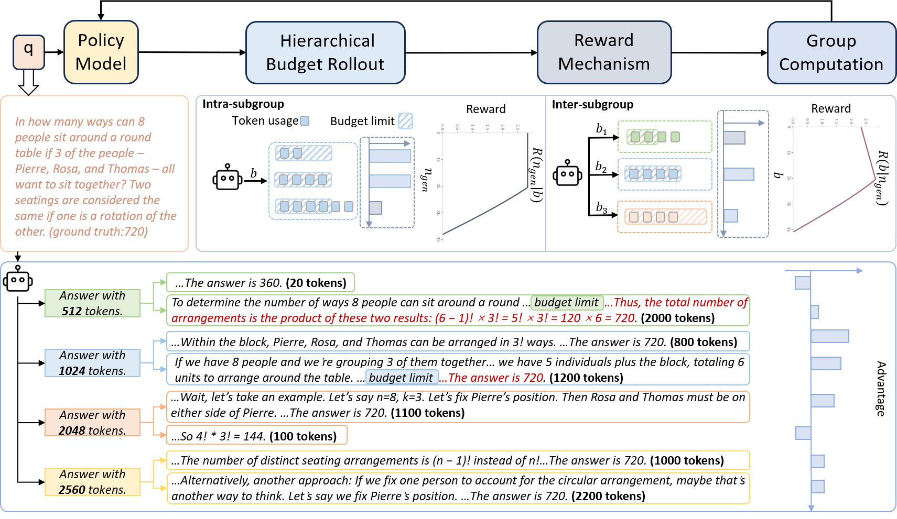

## Overview 🦾🦾






## QuickStart 🎯🎯

### 🔧 HBPO Training

#### Setup

```bash
git clone https://github.com/zju-real/hbpo.git

cd hbpo


# Create a new environment
conda create -n hbpo_env python=3.10
conda activate hbpo_env

# Install core dependencies
pip install -e .


```

#### train

```bash
zsh examples/grpo_trainer/run_qwen2-7b_deepscale.sh
```


### 🧠 Evaluation

#### Setup

```bash
# Create a new environment for evaluation
conda create -n eval_env python=3.10
conda activate eval_env

# Install required packages
git clone https://github.com/NovaSky-AI/SkyThought.git
cd SkyThought

pip install -e .
```

#### eval

```bash
skythought evaluate \
  --model  \
  --task math500 \
  --backend vllm \
  --sampling-params temperature=0.6,top_p=0.95,skip_special_tokens=False,max_tokens=32768 \
  --n 1 \
  --backend-args tensor_parallel_size=1 \
  --batch-size 128 \
  --result-dir ./
```

## Citation

```

```

